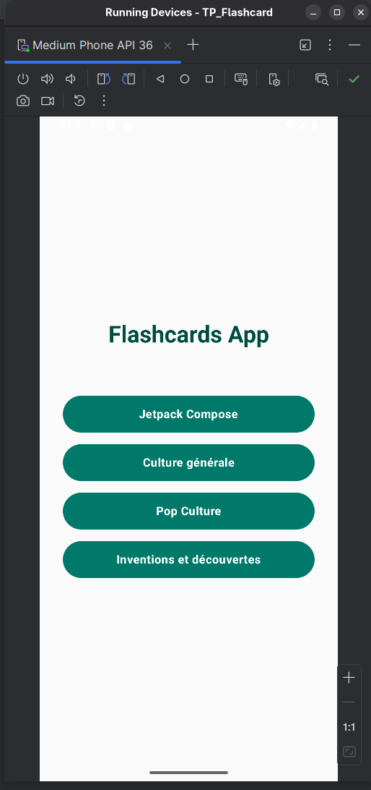
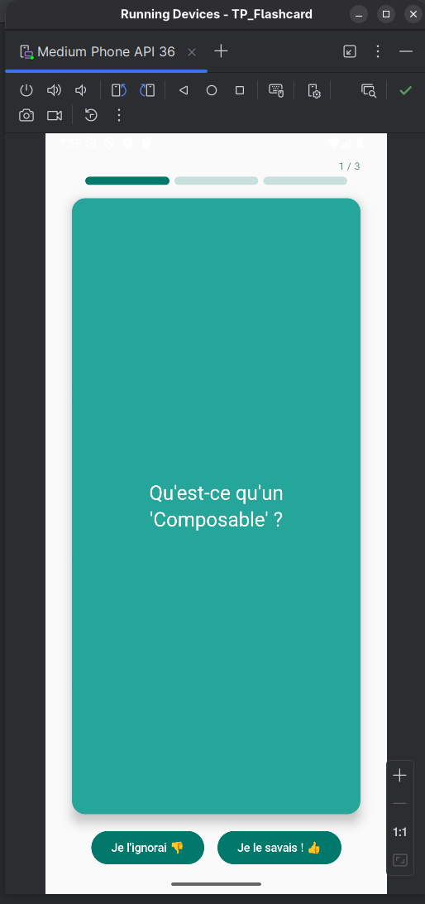

# CNAM Programmation Mobile

## À propos

Projet réalisé par [Théo LUDWIG](https://theoludwig.fr) dans le cadre de la formation [Ingénieur en Informatique et Systèmes d'Information (SI), CNAM](https://www.itii-alsace.fr/formations/informatique-et-systemes-dinformation-le-cnam/), pour le module Programmation Mobile.

[SUJET](./SUJET.md)

Pour tester l'application, un [APK est disponible](https://github.com/cnam-theoludwig/Android-Tp-Flashcards/releases/download/v1.0.0/app-release.apk).

## Prérequis

[Android Studio](https://developer.android.com/studio) v2024.3.2

## Résultat

| Écran d'accueil                               | Écran de révision d'une catégorie              |
| :-------------------------------------------- | :--------------------------------------------- |
|                        |                         |
| **FIGURE 1** Écran d'accueil de l'application | **FIGURE 2** Écran de révision d'une catégorie |
