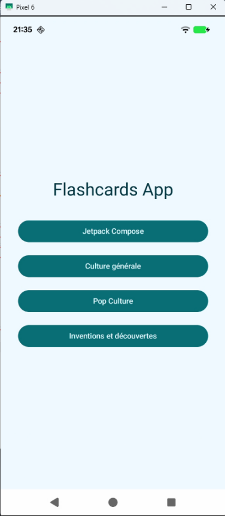
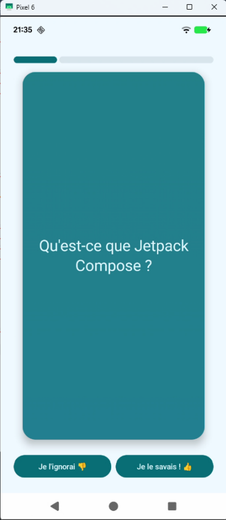

# TP noté - Application Flashcards

Développement Android avec Jetpack Compose

## Vue d'ensemble

Dans ce TP, vous allez développer une application de **révision par cartes**, permettant à l'utilisateur de réviser des questions/réponses organisées par catégorie. Vous partirez d'un squelette d'application comportant uniquement une `MainActivity` et un composant de navigation initial.

Le TP sera progressif : vous complèterez les différentes couches de l'application jusqu'à obtenir une version fonctionnelle et animée.

## Objectifs pédagogiques

1. Apprendre à séparer l'état de l'interface utilisateur avec un `ViewModel` et un `StateFlow`.
2. Implémenter une architecture MVVM complète.
3. Utiliser Jetpack Compose pour afficher une interface réactive.
4. Mettre en œuvre des animations simples dans l'UI.
5. Naviguer entre plusieurs écrans avec `NavHost`.

## Caractéristiques fonctionnelles

L'application FlashCard doit proposer les fonctionnalités suivantes :

### 1. Écran d'accueil

- L'écran d'accueil affiche la liste des catégories disponibles.
- Chaque catégorie est représentée de manière visuelle (nom, icône ou couleur, etc.).
- Un clic sur une catégorie démarre une session de révision.

### 2. Session de révision

- Les cartes de révision sont affichées une à une dans l'ordre défini.
- Chaque carte présente la question au recto.
- L'utilisateur peut cliquer sur la carte pour révéler la réponse via une animation de rotation.
- Une animation de transition accompagne le passage à la carte suivante.
- Une barre de progression permet à l'utilisateur de visualiser l'avancement de la session.
- Lorsque toutes les cartes d'une catégorie ont été affichées, l'application retourne automatiquement à l'écran d'accueil.

### 3. Navigation et animations

- L'application doit utiliser le système de navigation Jetpack Compose (`NavHost`) pour gérer les différents écrans (accueil, session de révision).
- Des animations doivent être présentes pour la rotation de la carte (question => réponse) et pour la transition entre les cartes.
- Une attention particulière est attendue sur la fluidité de l'expérience utilisateur.

## Critères de notation

- Fonctionnalités implémentées (7 points) : conformité globale aux exigences.
- Qualité de l'architecture et du code (6 points) : clarté, organisation, gestion d'état.
- Expérience utilisateur (3 points) : fluidité, interface agréable, animations.
- Bonnes pratiques et rigueur (1 point) : structure, commentaires, stabilité.
- **Bonus (3 points) :** Utilisation d'une base de données locale (Room) pour stocker les cartes.

## Consignes de rendu

- Le TP peut être réalisé seul ou à deux.
- Le rendu doit être effectué via un dépôt GitHub (ou autre plateforme git).
- Si le dépôt est privé, pensez à ajouter [hiertzjordan@gmail.com](mailto:hiertzjordan@gmail.com) en tant que collaborateur.
- Dans le fichier `README.md`, indiquez clairement le(s) nom(s) des participant(s).
- **Date limite de rendu : vendredi 20 juin 2025 à 23h59.**

## Exemples de l'application

| Écran d'accueil                               | Écran de révision d'une catégorie              |
| :-------------------------------------------- | :--------------------------------------------- |
|                  |                   |
| **FIGURE 1** Écran d'accueil de l'application | **FIGURE 2** Écran de révision d'une catégorie |

## 1. Prise en main du projet

Vous allez commencer ce TP en récupérant un squelette d'application déjà préparé.

### 1.1. Récupération du squelette

Le squelette est disponible sur GitHub à l'adresse suivante : <https://github.com/j-hiertz/Android-Tp-Flashcards>

1.  Cloner le dépôt avec la commande :
    ```bash
    git clone https://github.com/ton-lien-ici
    ```
2.  Ouvrir le projet dans Android Studio.
3.  Lancer une première compilation pour vérifier que le projet démarre correctement.

### 1.2. Contenu initial du projet

Le squelette contient les éléments suivants :

- `MainActivity.kt` : le point d'entrée de l'application, qui appelle le composant de navigation principal.
- `AppNavHost.kt` : un composant de navigation utilisant Jetpack Navigation Compose pour gérer les écrans.
- Le thème personnalisé dans le package `ui.theme`.

Le seul écran présent pour l'instant est l'écran d'accueil, affiché par défaut via le composant de navigation.

### 1.3. Dépendances du projet

Certaines dépendances utiles ont déjà été ajoutées dans le fichier `build.gradle.kts` (Module) :

- Jetpack Compose pour l'interface utilisateur déclarative.
- Navigation Compose pour gérer les transitions entre écrans.
- `ViewModel` et `StateFlow` pour la gestion d'état.

Vous pouvez consulter le fichier `build.gradle.kts` pour voir les versions exactes utilisées.

## 2. Développement

Vous pouvez suivre ce guide dans l'ordre proposé ou adapter votre démarche, tant que les fonctionnalités finales sont présentes et que le code reste structuré.

### 2.1. Création des modèles de données

Commencez par créer deux classes de données (`data class`) dans un fichier Kotlin dédié (par exemple dans un package `model`) :

```kotlin
// Represents a flashcard with a question and its answer
data class FlashCard(
    // Unique identifier for the card
    // Identifier for the category this card belongs to
    // Text of the question shown to the user
    // Text of the answer revealed after flipping the card
)

// Represents a category grouping multiple flashcards
data class FlashCardCategory(
    // Unique identifier for the category
    // Display name of the category
)
```

### 2.2. Création du FlashcardRepository

Créez un singleton Kotlin (`object`) nommé `FlashcardRepository` qui servira de source de données locale pour l'application. Ce repository doit exposer deux listes en lecture seule :

- Une liste de catégories (`List<FlashCardCategory>`)
- Une liste de cartes (`List<FlashCard>`)

Dans un premier temps, ces listes seront codées en dur dans le repository.

```kotlin
// Singleton providing flashcard data
// List of categories available in the app
val categories: List<FlashCardCategory> = listOf(
    // ...
)

// List of flashcards with references to categories
val flashcards: List<FlashCard> = listOf(
    // ...
)
```

Cette organisation vous permettra d'appeler facilement `FlashcardRepository.categories` et `FlashcardRepository.flashcards` depuis les `ViewModels`.

### 2.3. Création du HomeViewModel

Créez un `ViewModel` nommé `HomeViewModel` qui sera responsable de fournir la liste des catégories de flashcards à l'interface utilisateur. Pour cela, réfléchissez aux points suivants :

- Comment exposer une donnée observable et immuable depuis un `ViewModel` ? Pensez à utiliser un `StateFlow` avec une portée de visibilité adaptée.
- Comment initialiser cette donnée avec la liste des catégories fournies par le `FlashcardRepository` ? Où et comment charger ces données dans le `ViewModel` ?
- Quel est l'intérêt de ne pas exposer directement la propriété mutable à l'UI ?

Voici un petit squelette pour vous aider à démarrer (les détails d'implémentation sont à compléter) :

```kotlin
class HomeViewModel : ViewModel() {
    // TODO: Declare properties to hold the categories
}
```

**Indice :** Quelle structure Kotlin permet d'exécuter du code automatiquement dès la création d'une instance ? Réfléchissez à la façon de charger la liste des catégories dès l'instanciation du `ViewModel`.

### 2.4. Création du HomeScreen

L'objectif est de créer un ou plusieurs `@Composable` qui afficheront la liste des catégories sur l'écran d'accueil.

**Consignes :**

- Créez un composable `HomeScreen` qui prendra en paramètre un `HomeViewModel`.
- Utilisez les données exposées par le `HomeViewModel` pour afficher la liste des catégories.
- Vous pouvez décomposer l'UI en plusieurs petits composables si vous le souhaitez (par exemple un composable pour afficher une catégorie).

```kotlin
class MainActivity : ComponentActivity() {
    private val homeViewModel: HomeViewModel by viewModels()

    override fun onCreate(savedInstanceState: Bundle?) {
        super.onCreate(savedInstanceState)
        setContent {
            AppNavHost(homeViewModel = homeViewModel)
        }
    }
}
```

```kotlin
// Dans AppNavHost .kt
@Composable
    fun AppNavHost(homeViewModel: HomeViewModel) {
        val navController = rememberNavController()
            NavHost(navController, startDestination = " home") {
                composable("home") {
                    HomeScreen (homeViewModel = homeViewModel /** ... **/)
            }
        }
}
```

Cette organisation permet de partager un même ViewModel entre la MainActivity et le HomeScreen.

Habituellement, on préférerait utiliser l'injection de dépendances pour fournir le ViewModel, mais
pour ce cas simple, il est acceptable de le créer dans la MainActivity et de le passer en paramètre.

Vous pouvez maintenant commencer à implémenter le HomeScreen en affichant la liste des catégories reçues du HomeViewModel.

**Indice :** Pour rendre l'interface réactive aux données exposées par un Flow dans le ViewModel, il
peut être utile de convertir ce Flow en un état observable adapté à Compose. Une fonction Compose
dédiée facilite cette conversion.

### 2.5. Ajout de la navigation vers l'écran de révision

Votre objectif est d'ajouter une navigation depuis l'écran d'accueil (`HomeScreen`) vers l'écran de révision (`FlashcardScreen`) lorsqu'une catégorie est sélectionnée.

**Étapes à suivre :**

1.  Ajoutez une nouvelle route dans votre `NavHost` pour représenter l'écran de révision.
2.  Modifiez le composable `HomeScreen` pour accepter en paramètre une lambda `onCategoryClick` de type `(FlashCardCategory) -> Unit` qui sera appelée lors du clic sur une catégorie.
3.  Dans `HomeScreen`, déclenchez cette lambda quand une catégorie est sélectionnée (par exemple via un `Modifier.clickable`).
4.  Là où vous gérez la navigation, passez une implémentation de cette lambda qui navigue vers l'écran de révision.

**Indice :** Pour gérer la navigation avec Compose Navigation, vous pouvez utiliser le `NavController` et appeler la méthode adéquate pour naviguer vers une autre route.

### 2.6. Création du FlashcardUiState

Créez une `data class` nommée `FlashcardUiState` qui représente l'état de l'écran de révision. Elle doit contenir au minimum :

- L'index de la carte actuellement affichée.
- La liste des cartes à réviser.
- Un indicateur booléen indiquant si la session de révision est terminée.

Pensez à définir des valeurs par défaut adaptées pour faciliter la création d'un état initial. Réfléchissez à la manière dont vous pourrez détecter que la session est terminée à partir de cet état.

Cette classe sera utilisée dans le `ViewModel` pour gérer et exposer l'état de l'interface.

### 2.7. Création du FlashcardViewModel

Créez un `ViewModel` nommé `FlashcardViewModel` chargé de gérer l'état et la logique métier de l'écran de révision.

**À prévoir :**

- Reprenez la même approche que dans `HomeViewModel` pour gérer l'état avec une propriété privée mutable et une propriété publique en lecture seule.
- Implémentez une fonction qui charge les cartes correspondant à une catégorie donnée. Cette fonction pourra être appelée au moment de la navigation vers l'écran de révision.
- Implémentez une fonction pour passer à la carte suivante.
- Prévoyez la gestion de la fin des révisions, par exemple en mettant à jour un indicateur dans l'état.

### 2.8. Création de l'écran de révision (FlashcardScreen)

Dans cette étape, vous allez créer un composable `FlashcardScreen` qui sera affiché lorsque l'utilisateur sélectionne une catégorie. Ce composable doit afficher les éléments suivants :

- Une barre de progression indiquant l'avancement dans la liste des cartes
- La carte actuelle (question uniquement pour l'instant)
- Un bouton Suivant permettant de passer à la carte suivante

**Consignes :**

- Reprenez la même logique que pour le `HomeScreen` : passez le `ViewModel` en paramètre de `FlashcardScreen`.
- Affichez les données contenues dans le `FlashcardUiState`.
- Affichez d'abord uniquement la question, sans la réponse. L'ajout de la réponse sera traité plus tard.
- Pensez à structurer votre écran en découpant vos éléments dans des composables réutilisables.

### 2.9. Gestion des interactions dans l'écran de révision

À ce stade, votre `FlashcardScreen` affiche visuellement un bouton Suivant et la question, mais les interactions ne sont pas encore fonctionnelles.

**Consignes :**

- Implémentez une interaction pour basculer entre l'affichage de la question et celui de la réponse, par exemple en cliquant sur la carte.
- Gérez l'action du bouton Suivant pour passer à la carte suivante.
- Lorsque l'utilisateur arrive à la dernière carte, mettez en place un mécanisme pour revenir à l'écran d'accueil.

**Points de réflexion :**

- Où stocker l'état d'affichage question/réponse ? Dans le `ViewModel` ou localement dans le composable avec `remember` ?
- Comment gérer la navigation de retour à l'accueil à la fin du jeu de cartes ?

## 3. Amélioration de l'expérience utilisateur

Vous disposez désormais d'une application fonctionnelle permettant de naviguer entre l'écran d'accueil et l'écran de révision, d'afficher les cartes et d'interagir avec le bouton « Suivant ». Dans cette nouvelle section, nous allons nous concentrer sur l'amélioration de l'expérience utilisateur en ajoutant des interactions plus riches, en gérant plus finement l'état de l'interface, et en rendant la navigation plus fluide et intuitive.

### 3.1. Ajout d'une transition animée entre les cartes

L'objectif de cette étape est d'améliorer l'expérience utilisateur en ajoutant une animation lors du passage d'une carte à la suivante.

**Consignes :**

- Réfléchissez au type d'animation que vous souhaitez pour la transition entre les cartes (par exemple : glissement, fondu, rotation).
- Explorez les APIs d'animation proposées par Jetpack Compose, telles que `AnimatedContent` ou `AnimatedVisibility` etc.
- Implémentez une animation fluide et agréable pour l'affichage des cartes successives dans le composable de révision.

**Indice :** Consultez la signature des composables `AnimatedContent` ou `AnimatedVisibility` pour découvrir comment personnaliser les animations d'entrée et de sortie grâce aux paramètres.

### 3.2. Animation de rotation 3D pour afficher la réponse

Dans cette étape, vous allez ajouter une animation de rotation 3D sur la carte pour afficher la réponse lorsque l'utilisateur clique dessus. L'effet visé est une rotation autour de l'axe Y, comme si la carte se retournait pour révéler son verso.

**Consignes :**

- Vous aurez besoin d'un objet `Animatable` pour animer la valeur de la rotation (de 0 à 180°).
- Ce changement de valeur doit être déclenché dans une coroutine. Pour cela, utilisez un `CoroutineScope` obtenu via `rememberCoroutineScope()`.
- L'animation de la rotation s'applique via le `Modifier.graphicsLayer {}`.
    - Explorez les propriétés de `graphicsLayer` pour obtenir un effet de rotation 3D sur l'axe horizontal.
    - Pour accentuer l'effet 3D, ajoutez la ligne suivante : `cameraDistance = 8 * density`. Cela permet d'éloigner virtuellement la caméra pour éviter un effet d'écrasement lors de la rotation.
- Au clic sur la carte, déclenchez l'animation de rotation en mettant à jour la valeur de l'`Animatable` selon le sens de bascule (question \( \leftrightarrow \) réponse), en utilisant un `CoroutineScope` obtenu via `rememberCoroutineScope()` car l'animation est une fonction `suspend`.
- Affichez la question ou la réponse en fonction de la valeur actuelle de rotation (par exemple : si la rotation est inférieure à 90°, afficher la question ; sinon, afficher la réponse).
- Lors du changement de carte, réinitialisez la rotation et l'état de la face affichée. Pour cela, regardez du côté du composable `LaunchedEffect()`.

### 3.3. Améliorations et finalisation du projet

À ce stade, toutes les fonctionnalités principales de votre application sont en place. Il est maintenant temps de peaufiner les détails et de vous assurer que l'ensemble fonctionne correctement.

**Consignes :**

- Soignez le visuel de votre application :
    - Ajustez les marges, les paddings, les tailles de texte, les couleurs, etc.
    - Harmonisez les composants pour offrir une expérience cohérente et agréable à l'utilisateur.
- Vérifiez que toutes les fonctionnalités fonctionnent comme prévu :
    - Navigation entre les écrans
    - Avancement des cartes
    - Réinitialisation correcte de l'état à chaque changement de carte
    - Animation fluide et réactive
- Nettoyez votre code si nécessaire (suppression de code mort, renommage de variables, etc.)

## 4. Partie bonus

Si vous avez terminé toutes les fonctionnalités principales et que vous souhaitez aller plus loin, vous pouvez implémenter une base de données locale avec `Room` afin de stocker les questions/réponses de manière persistante.

**Objectifs possibles :**

- Remplacer la liste codée en dur par une base de données Room.
- Deux approches possibles pour remplir la base :
    - Préremplir la base avec des données intégrées à l'application : <https://developer.android.com/training/data-storage/room/prepopulate?hl=fr>
    - Insérer les données au premier lancement en appelant les requêtes d'insertion depuis votre Repository.
- Adapter votre Repository pour qu'il lise les données depuis la base de données plutôt que depuis une liste statique.

Pour vous aider, vous pouvez suivre ce [codelab officiel](https://developer.android.com/codelabs/basic-android-kotlin-compose-persisting-data-room?hl=fr) sur l'utilisation de Room avec Jetpack Compose.

> Bravo pour votre travail ! Prenez le temps de peaufiner votre application : une interface soignée et un comportement fluide font toute la différence d'une bonne expérience utilisateur.
